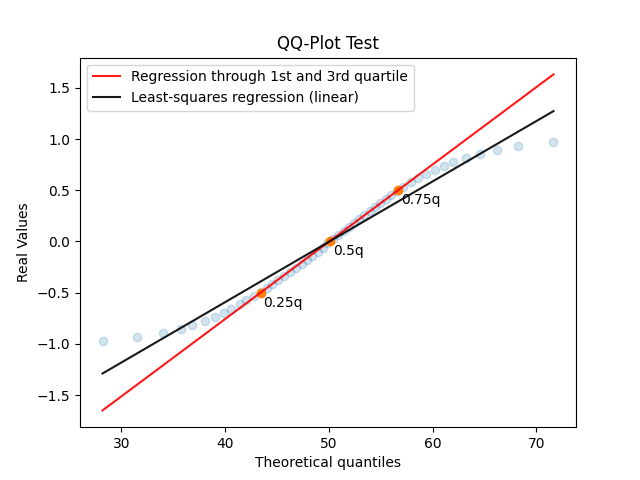

# QQ-Plot 2 Sample
Just a gist to include the custom code to draw a qq-plot in python when dealing with a "two sample problem".
This means when u try to plot/fit a data sample against another data sample without knowing the pdf of the theoretical quantiles.

Example of the current qq-plot result:


## Prerequisites
venv:
```bash
python3 -m venv venv
source venv/bin/activate
pip install -r requirements.txt
```

## Development
test (run the qq-plot test):
```bash
python setup.py pytest
```

build:
```bash
python setup.py bdist_wheel
```

install:
```bash
pip install dist/wheelfile.whl
```

import:
```bash
import qq_plot_2samp
from qq_plot_2samp.qq_plot import draw_qq_plot
```
